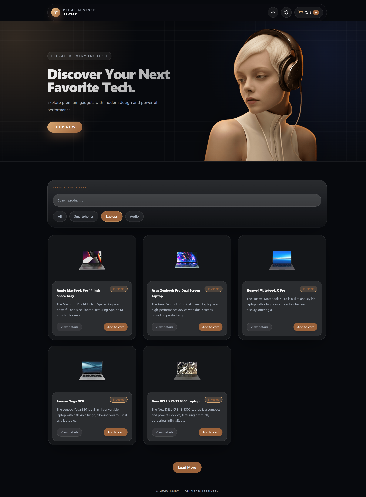
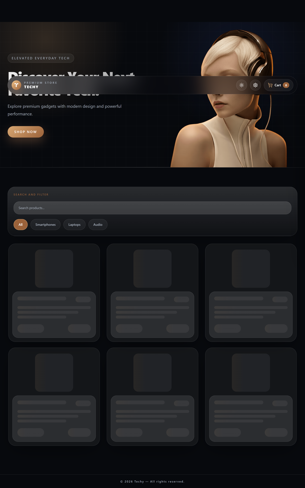
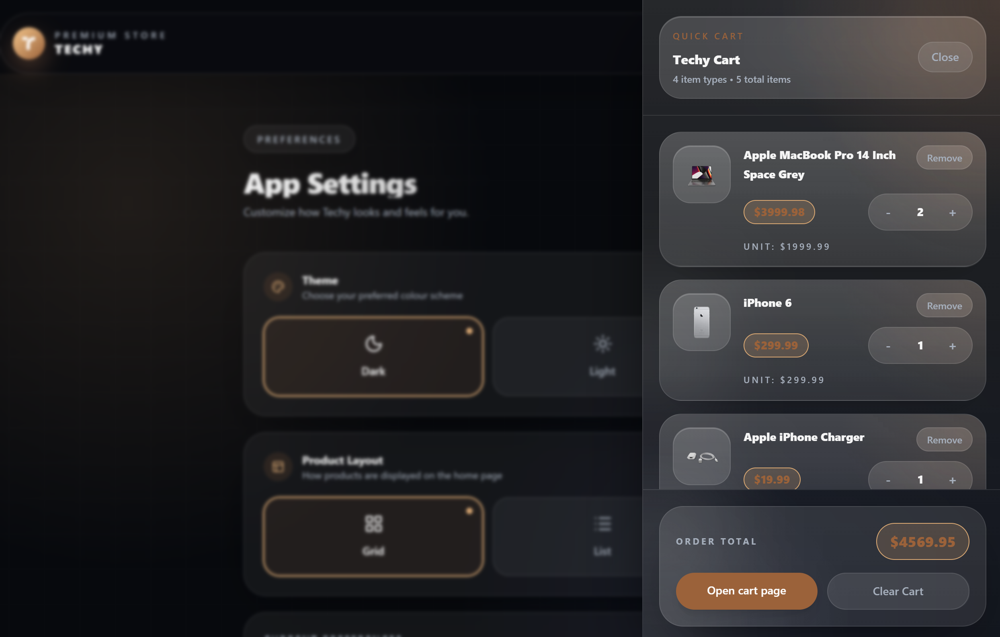
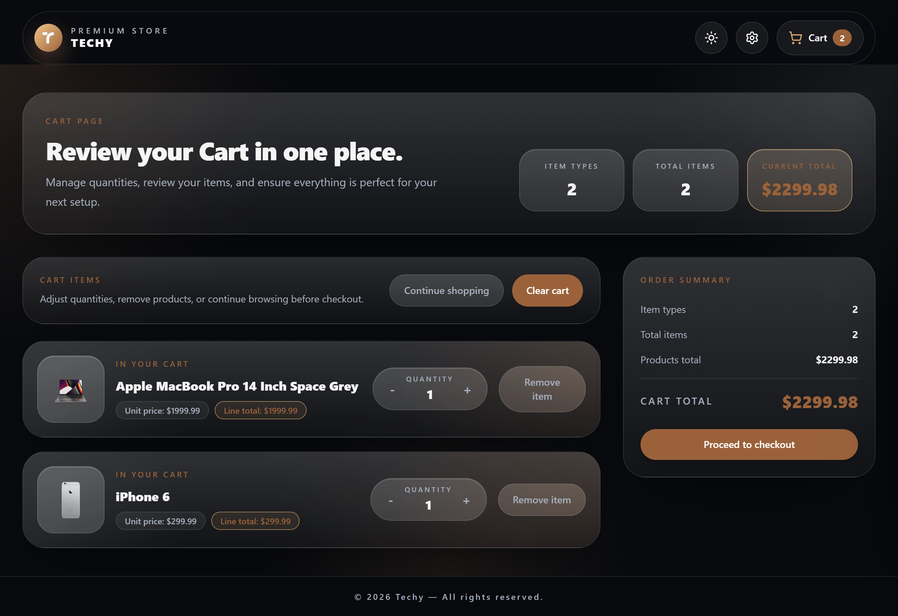
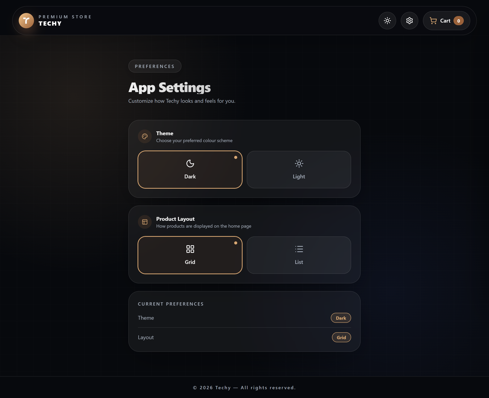
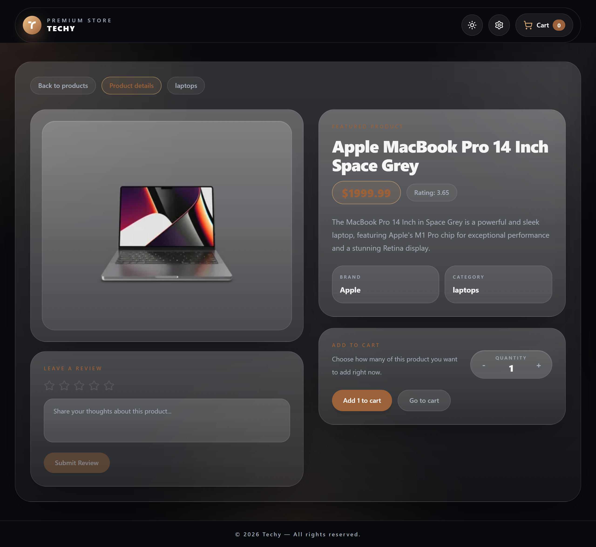
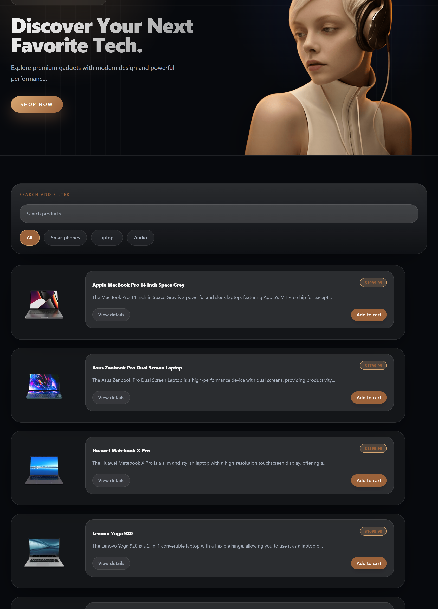
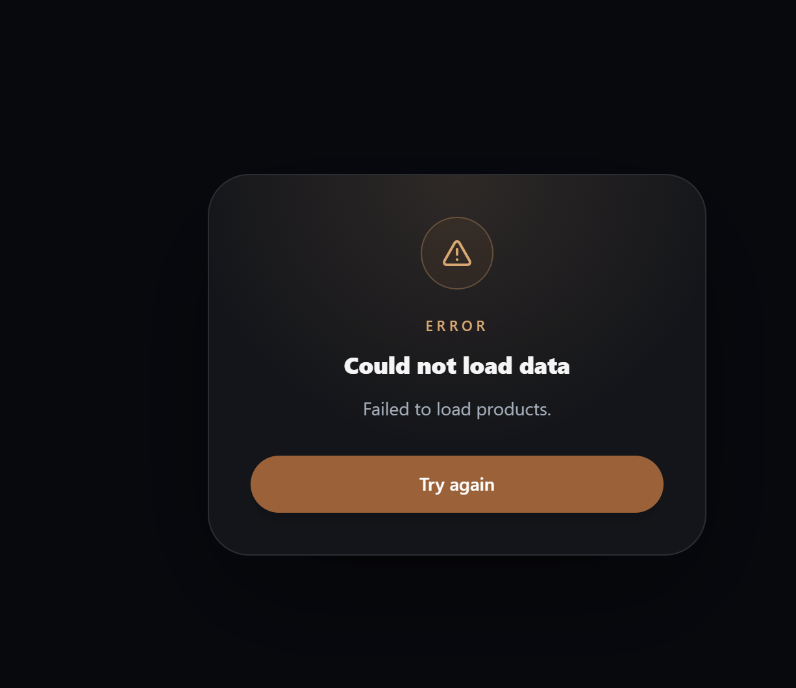

# Techy - Product Store App

A product store app built with React where you can browse tech products, manage your cart, and switch between dark and light mode.

---

## What the App Does

- Browse tech products fetched from an API
- Search products by name
- Filter by category (smartphones, laptops, audio)
- Add products to cart, change quantity, or remove them
- Switch between dark and light mode
- Leave a review on any product
- Responsive design that works on all screen sizes

---

## Tools and Libraries Used

| Tool | What I used it for |
|---|---|
| React | Building the UI |
| Redux Toolkit | Managing the cart state |
| Context API + useReducer | Managing theme and app settings |
| React Query | Fetching products from the API |
| Tailwind CSS | Styling |
| React Router | Navigation between pages |

---

## Features Completed

-  Products fetched from DummyJSON API
-  Loading skeleton while products fetch
-  Error message if fetch fails
-  Search and category filter
-  Infinite scroll / Load more
-  Working cart (add, remove, increase, decrease, clear)
-  Cart total items and total price
-  Dark / light mode
-  Responsive on all screen sizes

---

## Project Structure

```
src/
│
├── app/
│   ├── store/
│   ├── providers/
│  
│
├── features/
│   ├── cart/
│   └── context/
│
├── pages/
│   ├── Home/
│   ├── Cart/
│   ├── ProductDetails/
│   └── Settings/
│
├── components/
│   ├── layout/
│   ├── product/
│   ├── cart/
│   └── home/
│
├── services/
│
├── hooks/
│
├── utils/
│
|── routes/
│
|── routes/
│
├── assets/
│   ├── images/icon

```
## How to Run the Project

1. Clone the repository
   https://github.com/humairaa-k/Product-Store-App

2. Install dependencies
    npm install

3. Start the app
   npm run dev

## Screenshots










## What I Learned

This project helped me understand when to use different state management tools in React:

- **Context API** is great for app-wide settings like theme that many components need
- **Redux Toolkit** works well for complex state like a cart that needs to update across many pages
- **React Query** makes fetching data much easier by handling loading, errors, and caching automatically

---
## Future Improvements

As I continue learning React and frontend development, there are a few things I would love to add to this project:

- User authentication so each person has their own cart and order history
- A checkout page with a simple order form
- Animations and smoother page transitions
- Better filters like sorting by price or rating
- Build a real backend with Node.js and Express to handle orders and users
- Connect to a real database so product and cart data is actually saved
---
## About

This project was built as a course assignment. It was a great 
hands-on experience that helped me understand how real world React apps are structured.

